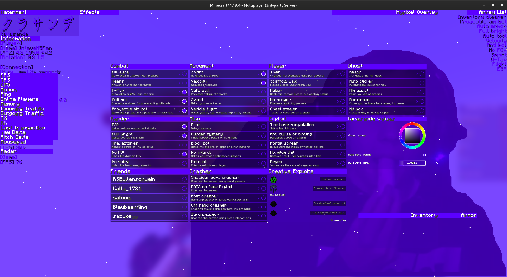

# tarasande

## [**Join the discord**](https://discord.gg/CrHvnn6cJd)

## The story
This cheat was developed since late 2021, and after another developer joined, things began rolling downhill. That resulted in the cheat being less fun for me and now being open-source after he tried to run off with the source code.

## Design ideology
Most of the features were developed to include possible new features without changing the existing code. The needed maintenance was supposed to stay low.

## Usage
The cheat does not modify any minecraft elements, every new widget is in the iconic panel style:

### Account manager
The account manager splits logging in and updating the session.  
Don't forget to set your session after logging in.

### Panel screen
The panel screen is bound to `right-shift` by default. This can be changed however.  
Panels are clamped into the visible viewport.

#### Configuring panels
Panels can be middle-clicked on the title bar, which will open a menu with all its values.  
If it doesn't, the panel does not have any values.

#### Key binds
- Using the `alt` key, you can align panels with each other
- Using the `arrow` keys, you can adjust hovered sliders in small steps. (The handle which you are changing on range sliders is the side the mouse is on)
- Using the `ctrl+v` shortcut in text field screens, will automatically fill in the clipboard content into the text fields, as long as no text field is focused and the clipboard content is in the common colon-separated format

### Modules
Most modules have values, make sure to check if you configured a module according to your needs.

#### ESP
The shader esp uses the minecraft spectral arrow esp.  
An optional texture pack, which can be found in the run folder of this repository, can improve its looks.  
This decision was made in order to allow compatibility with other mods, which modify the entity rendering.

### Package system
The package system was introduced after design choices become complicated.  
Packages either add more features, add support or do other miscellaneous changes to the game, which aren't important enough to belong to the main mod.  
To install a package drop it into your mods folder like any other fabric mod.

### File management and values
Location:
- `%userprofile%/tarasande` on Windows
- `~/tarasande` on Linux

The cheat does create backups and labels them `[filename]_Backup`. These files might come in handy whenever you or the cheat messed up.
The account manager file will be encrypted if you are on Windows. (Linux is not supported due to limitations with [oshi](https://github.com/oshi/oshi))

Values are the way the cheat saves your configuration.  
To share your configuration, you need to send the Values file.

### Support
Windows and Linux are supported. I do not own MacOS hardware, so there is no official support for it. Launching the cheat under MacOS shouldn't pose much of a challenge however.

## Download
I am not offering binary downloads. You can compile it yourself, trust me.

Download the repository using `git clone https://github.com/Sumandora/tarasande.git`
Updates can be downloaded by running `git pull` in the cloned repository.

### IDEs
Opening the repository using an IDE is possible and recommended for development, the following instructions will only show how to compile/run the cheat with a command-line/terminal.

### Compile from source
Building requires JDK17.

- On Windows, run `gradlew build`
- On Linux, run `./gradlew build`

This will compile the base cheat with all packages.  
You can find the base cheat in the `build/libs` folder.

### Running from source
Running requires JDK17.

First you have to generate the source code

- On Windows, run `gradlew genSources`
- On Linux, run `./gradlew genSources`

Due to the amount of packages this process may take up to an hour on slow hardware.  
After that run:

- On Windows, run `gradlew :runClient`
- On Linux, run `./gradlew :runClient`

This will run the base cheat in a development environment.  
Your working directory will be the run folder in the repository root.  

### Installing the packages
Run the following command if you didn't do it already.

- On Windows, run `gradlew build`
- On Linux, run `./gradlew build`

If you are running the cheat in a dev environment run:

- On Windows, run `gradlew installPackages`
- On Linux, run `./gradlew installPackages`

You can now start the cheat again and will have all packages installed.  

If you are not running a dev environment enter the package folder you want.  
Enter the `build/libs` folder of the package folder and move the main jar file to your mods folder.  
The "main" jar file is the one without any suffix other than the version.

## Can I include source code from this cheat in mine?
As long as you don't violate the [license](https://www.tldrlegal.com/license/gnu-general-public-license-v3-gpl-3) it is fine.  
I know that most developers are actively working against open-source by ignoring licenses, in case you are planning on doing so, please take your medicine.

I'm going to give a quick rundown on the most important features, which you probably want to copy first:
|Feature|Description|
|-------|-----------|
Grabbers|An automatic updating process|
Event-based system|A way for the features to communicate with other features without interfering with them.|
|Rotation Leak Prevention|A old anticheat check which was discovered a long time ago, yet only few anticheats implement it and even less cheats actually fix it.|
|Click method: Dynamic|A mathematical formula, which defines the click pattern|
|Crasher package|Contains, at the time of this release, unknown crashers (Made by the other developer)|
|Tick base manipulation|Allows to manipulate the in-game clock   [https://youtu.be/CQq31abCPsg](https://youtu.be/CQq31abCPsg)   [https://youtu.be/2aqbEvrEdJ4](https://youtu.be/2aqbEvrEdJ4)|
|Inventory cleaner|An approach to inventory cleaners, in which the user chooses between equally good items|
|Scaffold walk|Rotations, which are nearly impossible to separate from the ones of a legit player   [https://youtu.be/Xus2F-HloWs](https://youtu.be/Xus2F-HloWs)|
|Bed ESP|A Bed ESP, which calculates the best way to break a bed   |
|Preferred off hand item|Auto Totem, which does not perform illegal inventory actions (You can't move an item from every slot to every other slot with only one mouse click, you need two in the worst case)|
|Block bot|A griefing module, which moves into other players line of sight in order to annoy them|
|Dropper|A module which uses prediction to solve dropper puzzles   [https://youtu.be/W48PQ_7nDDQ](https://youtu.be/W48PQ_7nDDQ)|
|Prediction engine|Allows prediction of local and other player entities|
|Protocol spoofers|Makes it appear as you are using a different client (Made by both developers)|
|Code checker|A tool made to automatically quality control the source code|
|Kill aura|If not the best multi-version PvP Kill aura (including adjustments for 1.11 shield changes)   [https://youtu.be/ntseC-D75HQ](https://youtu.be/ntseC-D75HQ)|
|Nuker|A nuker, which does not violate badpackets, unlike in a billion other cheats|
|Murder Mystery|An over-engineered solution to finding murderers in Murder Mystery|
|Trouble in terrorist town|Using assumptions and approximations to generate a hit-log|

This list could continue for another 50 entries, but I think these are the most important and "revolutionary" things this cheat has to offer.  
To clear confusion: If I didn't state, who made something, it was me.

Please note that the combat features, may not be as undetected as other cheats I made, because I cared less about them. However I didn't have issues using the cheat on any servers.

Also note that the rendering code is largely inefficient and was made to be easy not fast.

## Accomplishments
- This cheat managed to get to the top of Hypixels Sumo PvP leaderboard.  
- This cheat beat several other cheats (some with prices of up to 100€), while the cheaters usually don't even see that they were killed by a cheat.
- Bypassed killaura checks of anticheats with many years work put into them.
- The cheat was used as a ghost cheat in many high-rank games. Many modules were used (e. g. Kill aura and Scaffold walk) but the cheating went unnoticed for months and years.

## Contribution
Contributions are welcome.  
Issues and pull requests will be reviewed.

## Going forward
After this goes public you can prepare for most features to get patched.
Magic values, like click pattern or rotations are probably gonna take a bit longer than the other modules, but you can prepare for these to get patched too.  
I recommend changing some values in these features in order to make them undetected again.  
I am going to maintain this project and even add more features to it, but I'm not promising that this project will be "revived".